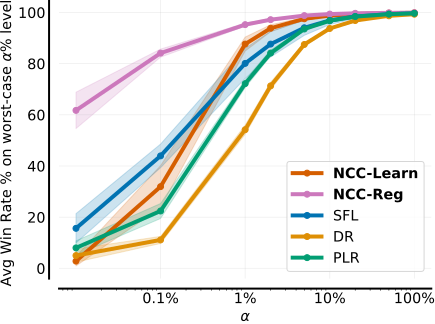

# An Optimisation Framework for Unsupervised Environment Design

<p align="center">
       <a href= "https://github.com/nmonette/NCC-UED/blob/main/LICENSE">
        </a>
       <a href= "https://openreview.net/forum?id=WnknYUybWX">
        </a>
        <a href= "https://nmonette.github.io/optimising-ued/">
        </a>
        
</p>

NEWS: Our paper was accepted into <a href= "https://rl-conference.cc/">Reinforcement Learning Conference 2025</a>! We are excited to meet you in Edmonton 😊

This repo is heavily based on the code from <a href= "https://github.com/amacrutherford/sampling-for-learnability">SFL</a>, 
 <a href= "https://github.com/DramaCow/jaxued">JaxUED</a> and <a href= "https://github.com/dunnolab/xland-minigrid">XLand-Mingrid</a>. Much thanks to these authors! 
 
 ## Environments
 We test in the following environments:
 
 1. [Minigrid](minigrid): 2D Maze Navigation
 2. [Xland-Minigrid](xland): 2D "Maze" Navigation version of  <a href= "https://deepmind.google/discover/blog/generally-capable-agents-emerge-from-open-ended-play/">XLand</a>.
 3. [Craftax](craftax): A JAX reimplementation of Crafter, plus additional features, world generation, and achievements.

We have a directory for each environment. For each, there is a makefile, in which you run `make build` to build the docker image, and `make run` to run a docker container. 

You can then run any of the files to run any of their respective algorithms.

## Paper TL; DR
In essence, we use gradients to _learn_ a <a href="https://arxiv.org/abs/2010.03934">PLR</a> distribution. This allows us to obtain convergence guarantees, and ultimately leads to superior performance when the method is extended to its practical variant. We evaluate our method using both the $\alpha$-CVaR evaluation protocol and also the holdout level sets from each test environment. We also propose a new score function (generalised learnability), and show it emphasizes levels of intermediate difficulty (a principle emphasized in <a href="https://arxiv.org/abs/2408.15099">SFL</a>). 

## $\alpha$-CVaR Evaluation
The $\alpha$-CVaR evaluation tests policies under their $\alpha$% worst case levels. Our method obtains very strong performance on Minigrid in this regime:

<p align="center"></img></p>

In order to recreate these results, look in each environment's `deploy` directory. After running the corresponding experiments, first generate the levels in `...generate_levels.py` (not needed with Craftax), then evaluate the proper runs in `...rollout.py` and finally produce the plots in `...analyse.py`.

## BibTeX citation
If you use our implementation or our method in your work, please cite us! 
```bibtex
@inproceedings{
  monette2025an,
  title={An Optimisation Framework for Unsupervised Environment Design},
  author={Nathan Monette and Alistair Letcher and Michael Beukman and Matthew Thomas Jackson and Alexander Rutherford and Alexander David Goldie and Jakob Nicolaus Foerster},
  booktitle={Reinforcement Learning Conference},
  year={2025},
  url={https://openreview.net/forum?id=WnknYUybWX}
  }
```

